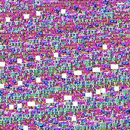

# EdgeAI Jetson Nano LLIE

## Introduction

This is a project for Low-light image enhancement with edge AI computations using Jetson Nano.  
LLIE approach: CPGA-Net  
Python == 3.6

## Installation
### ONNX
Follow this link [Jetson Zoo](https://elinux.org/Jetson_Zoo)
1. onnxruntime
```
# Download pip wheel from location above for your version of JetPack  
wget https://nvidia.box.com/shared/static/pmsqsiaw4pg9qrbeckcbymho6c01jj4z.whl -O onnxruntime_gpu-1.11.0-cp36-cp36-linux_aarch64.whl

pip3 install onnxruntime_gpu-1.11.0-cp36-cp36-linux_aarch64.whl
```
### TensorRT
[TensorRT Installation Guide](https://docs.nvidia.com/deeplearning/tensorrt/install-guide/index.html)  
[TensorRT Intro Notebooks](https://github.com/NVIDIA/TensorRT/tree/release/10.0/quickstart/IntroNotebooks)

For installing TensorRT in a conda environment, you can refer to this [forum post](https://forums.developer.nvidia.com/t/need-support-with-installing-tensorrt-in-a-conda-env-on-orin-nx/269113)

1. pycuda
2. tensorrt

## Usage
### Pytorch to ONNX
[PyTorch tutorial on exporting a simple model to ONNX](https://pytorch.org/tutorials/beginner/onnx/export_simple_model_to_onnx_tutorial.html)  
[Exporting a Model from PyTorch to ONNX and Running it using ONNX Runtime](https://pytorch.org/tutorials/advanced/super_resolution_with_onnxruntime.html)
```
dummy_input = torch.randn(1, 3, 256, 256)
torch.onnx.export(network, dummy_input, MODEL_NAME+'.onnx' )
```
# ONNX
```
python3 demo_onnx.py

# TRT
trtexec --onnx=OV_enhance_color-llie-ResCBAM_g.onnx --saveEngine=CPGANet_engine.trt --explicitBatch --workspace=128
python3 demo_trt.py
```

## Runtime Performance
Image Resolution: 256x256
Pytorch | ONNX (CUDA) | ONNX (TRT) | TensorRT |
|----------|----------|----------|----------|
| 139.343681 ms   | 110.399661 ms   |83.792326 ms   |72.907643 ms   |

## Results
Here are some example images enhanced using the LLIE approach:
### Pytorch

### ONNX

### ONNX (TRT)

### TensorRT


Image From [LIME](https://ieeexplore.ieee.org/document/7782813)
## Issues
TensorRT doesn't perform normally with unknown issue, 

# Reference
1. [PyTorch Official Documentation](https://pytorch.org/docs/stable/index.html)
2. [ONNX Official Documentation](https://onnx.ai/documentation/)
3. [TensorRT Official Documentation](https://docs.nvidia.com/deeplearning/tensorrt/developer-guide/index.html)
4. [Jetson Nano Developer Kit](https://developer.nvidia.com/embedded/jetson-nano-developer-kit)
5. [EdgeAI LLIE NCS2 GitHub Repository](https://github.com/Shyandram/EdgeAI_LLIE_NCS2.git)
6. [CPGA-Net-Pytorch GitHub Repository](https://github.com/Shyandram/CPGA-Net-Pytorch)